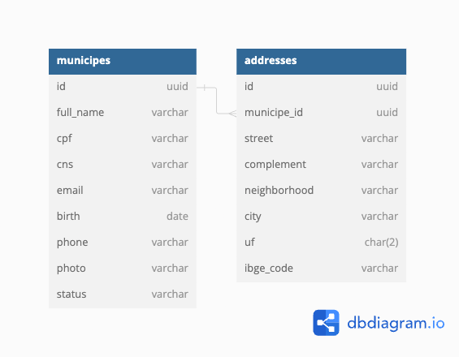

# Desafio - OM30

## Visão Geral
O desafio OM30 é um projeto que envolve a criação de um CRUD (Create, Read, Update, Delete - com exceção do Delete) para o gerenciamento de munícipes. O sistema deve permitir o cadastro e a atualização de informações de cidadãos dentro de um município, além de oferecer funcionalidades para alterar o status dos munícipes entre ativo e inativo.

## Funcionalidades
- CRUD de Munícipes: Os usuários devem ser capazes de criar, visualizar e atualizar munícipes. A exclusão não é necessária.
- Status do Munícipe: Cada munícipe possui um status que pode ser ativo ou inativo.
- Validações: Garantir a validade dos dados inseridos, como CPF, CNS (Cartão Nacional de Saúde) e email.
- UI/UX Flexível: Embora sugerido o uso de apenas duas páginas para simplicidade, a estrutura UI/UX fica a critério do desenvolvedor para otimização da experiência do usuário.
- Notificações: Enviar email e SMS para munícipes após o cadastro ou atualização de informações, incluindo mudanças de status.
- Filtragem: Permitir a busca de munícipes por diferentes critérios, incluindo dados pessoais e de endereço.
Entidades Principais
- Munícipe: Entidade principal contendo informações pessoais como nome, CPF, CNS, email, data de nascimento, telefone, foto e status.
- Endereço: Entidade relacionada que armazena informações de endereço do munícipe, incluindo CEP, logradouro, bairro, cidade, UF, entre outros.

[Leia mais sobre a descrição do projeto](about_the_project.md)

## Modelagem do Banco de Dados

## Executando o projeto

### Execução Sem Docker
Instale o Ruby: Certifique-se de ter o Ruby 3.3.0 instalado em seu sistema. Você pode usar ASDF, rbenv ou rvm para gerenciar as versões do Ruby.

Clone o Repositório: Clone o repositório do projeto para a sua máquina local.

Instale as Dependências: No diretório do projeto, execute bundle install para instalar todas as gemas necessárias.

Configuração do Banco de Dados: Certifique-se de ter o PostgreSQL instalado. Crie um banco de dados e configure o arquivo config/database.yml com as credenciais do seu banco de dados local.

Criação e Migração do Banco de Dados: Execute rails db:create e rails db:migrate para criar e migrar seu banco de dados.

Inicie o Servidor: Execute rails server para iniciar o servidor Rails. Por padrão, o servidor será acessível em http://localhost:3000.

### Execução Com Docker
Construa a Imagem Docker: No diretório do projeto, execute docker-compose build para construir a imagem Docker do projeto com base no Dockerfile.

Inicialize o Banco de Dados: Execute docker-compose up db para iniciar o serviço de banco de dados. Aguarde até que o banco de dados esteja completamente inicializado.

Crie e Migre o Banco de Dados: Com o serviço de banco de dados rodando, abra um novo terminal e execute docker-compose run web rails db:create db:migrate para criar e migrar o banco de dados no contexto do Docker.

Inicie a Aplicação: Execute docker-compose up para iniciar todos os serviços, incluindo o servidor web. A aplicação estará disponível em http://localhost:3000.

Ao usar Docker, todos os serviços necessários para a aplicação, incluindo o banco de dados e o servidor web, são encapsulados em contêineres, garantindo um ambiente consistente e isolado para a execução do projeto.

## Próximos passos e melhorias

### Arquitetura
- Implementar casos de uso para todas as actions CRUD da entidade Municipe;
- Implementar e garantir cobertura de testes para os casos de uso;

### Funcionalidades
- Implementar o cadastro do endereço, utilizando accepted nexted attributes;
- Implementar o cadastro de endereço dentro do formulário de criação de municipes;
- Implementar o envio de SMS ao criar um novo municipe;
- Implementar o envio de SMS ao atualizar o status de um municipe;
- Adicionar a busca contextual utilizando ElasticSearch;

### Deploy
- Elastic Beanstalk: Utilize o AWS Elastic Beanstalk para facilitar o deploy e a gestão da aplicação. O Elastic Beanstalk suporta aplicações Ruby on Rails e automatiza o processo de deploy, desde a provisão de infraestrutura até o monitoramento da aplicação.
- RDS para PostgreSQL: Configurar uma instância do Amazon RDS para PostgreSQL para gerenciar o banco de dados da aplicação. O RDS facilita a configuração, a operação e a escalabilidade de um banco de dados relacional na nuvem.
- S3 para Armazenamento: Utilizar o Amazon S3 para armazenar arquivos estáticos e uploads de usuários. O S3 oferece alta disponibilidade e durabilidade para os seus arquivos.
- EC2: para hospedar a aplicação, configurando o ambiente manualmente.
- Elastic Load Balancing: Utilizar o Elastic Load Balancing para distribuir o tráfego de entrada entre as instâncias da sua aplicação, melhorando a tolerância a falhas e a escalabilidade.
- Auto Scaling: Configurar o Auto Scaling para ajustar automaticamente o número de instâncias de acordo com a demanda, garantindo performance e reduzindo custos.
- IAM: Utilizar o AWS Identity and Access Management (IAM) para gerenciar acessos e permissões de forma segura.
- CloudWatch: Utilizar o Amazon CloudWatch para monitorar a aplicação e os recursos da AWS, permitindo visualizar logs, métricas e definir alarmes.
- Certificado SSL/TLS: Configurar um certificado SSL/TLS, usando o AWS Certificate Manager (ACM) para melhorar a segurança da sua aplicação.
- Pipeline de CI/CD: Configurar um pipeline de integração contínua e entrega contínua (CI/CD) usando o AWS CodePipeline, CodeBuild e CodeDeploy para automatizar o teste e o deploy da sua aplicação.
- Amazon Elasticsearch Service (Amazon ES) para criar e configurar uma instância do Elasticsearch.
- O Amazon Elasticsearch Service fornece um endpoint do Kibana. Acesse o Kibana através desse endpoint para monitoramento e alertas. Utilizar as funcionalidades do Kibana e do Amazon ES para configurar alertas baseados em condições específicas nos logs ou métricas de busca.